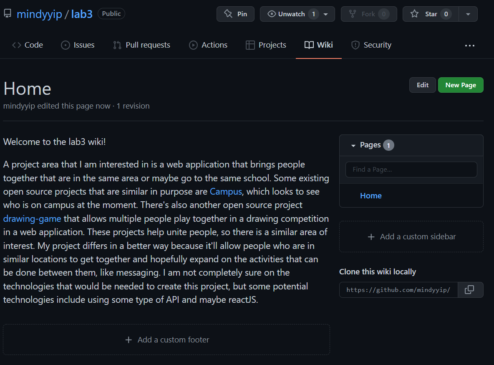

## Part 1

### Documentation
[Lab 3 Wiki](https://github.com/mindyyip/lab3/wiki)

### Latex

#### Formulas and Matrix

## Part 2

### allennlp

1 contributor

2,656  lines of code

First Commit: March 8, 2021

[First Commit Link](https://github.com/gabeorlanski/allennlp-readers-development/commit/575b7c748323afd0751bd041f56ed5ca1d03151b)

Latest Commit: May 1, 2021

[Latest Commit Link](https://github.com/gabeorlanski/allennlp-readers-development/commit/cf65578d532dd10c4de0ceb2328053e94d1cac4b) 

There are two current branches: master and superglue_record

After running gitstats, the number of contributors was actually 2. The number of lines differed a little. With gitstats, the total number of lines was 2,662 instead of 2,656. The first commit and the last commit are the same.

### gource youtube link
[Gource Video](https://youtu.be/e7szbIzYqmA)

