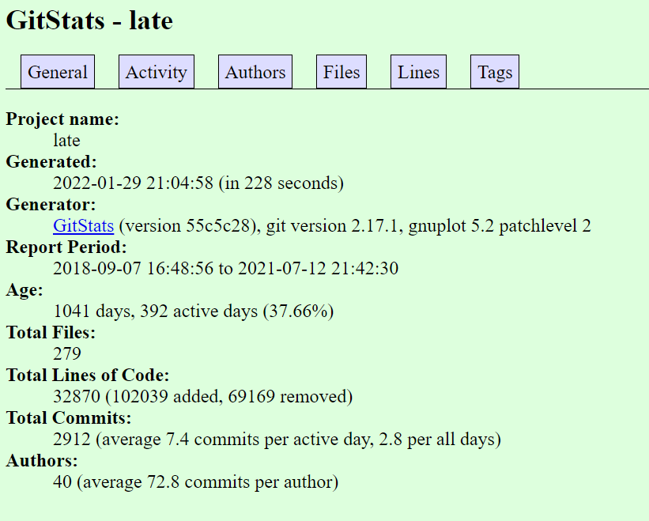
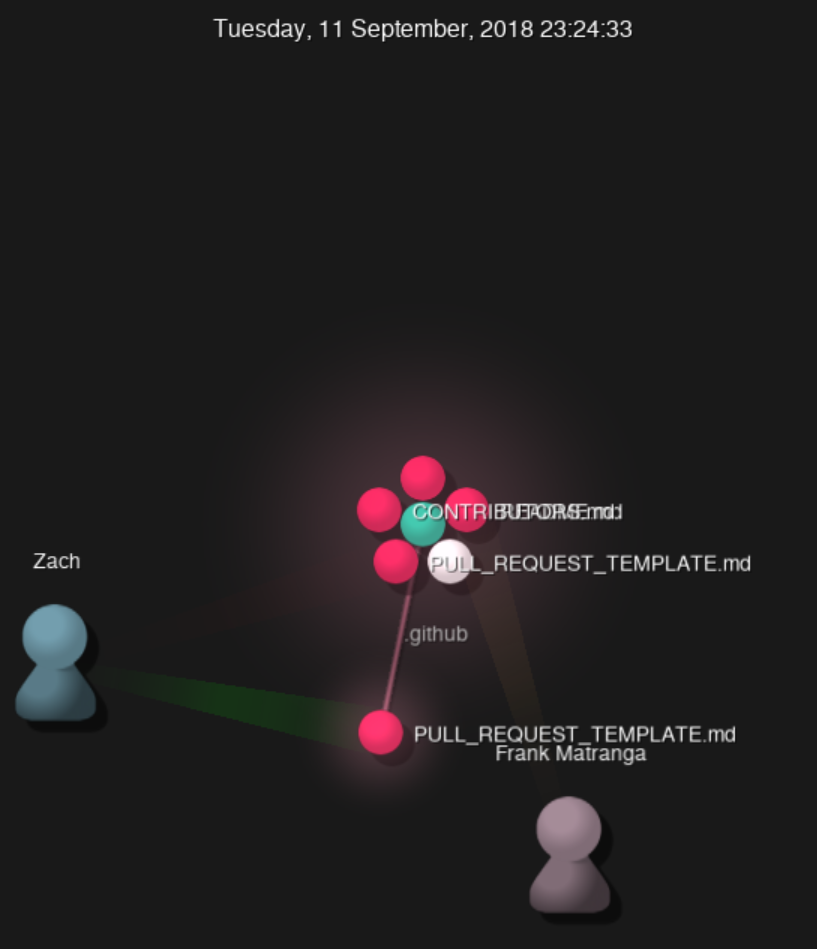

## Part 1

### Documentation
[Lab 3 Wiki Link](https://github.com/mindyyip/lab3/wiki)

### Latex

#### Formulas and Matrix

## Part 2

### 1. allennlp

1 contributor

2,656  lines of code

First Commit: March 8, 2021

[First Commit Link](https://github.com/gabeorlanski/allennlp-readers-development/commit/575b7c748323afd0751bd041f56ed5ca1d03151b)

Latest Commit: May 1, 2021

[Latest Commit Link](https://github.com/gabeorlanski/allennlp-readers-development/commit/cf65578d532dd10c4de0ceb2328053e94d1cac4b) 

There are two current branches: master and superglue_record

After running gitstats, the number of contributors was actually 2. The number of lines differed a little. With gitstats, the total number of lines was 2,662 instead of 2,656. The first commit and the last commit are the same.

[Gource Video](https://youtu.be/e7szbIzYqmA)

### 2. AI-Gym-Tracker

5 contributors

119940 lines of code

[First Commit](https://github.com/AlbMej/AI-Gym-Tracker/commit/e0bf1469d1cc511cc41b17b91471e1846390ef82)

Nov 15, 2019

[Latest Commit](https://github.com/AlbMej/AI-Gym-Tracker/commit/3074facc9771444b691c3680b2d8f52303badead)

April 17, 2020

The branches are master, rest-testing, djongo-testing, android, williesrepo, and website-rewrite.

When running gitstats, the total lines of code is 102,395 and there are 8 authors.

### 3. AIPS

5 contributors

343,213 lines of code

[First Commit](https://github.com/shinoka7/aips/commit/f1a3f43f65e2253317113548e5c577cd68ae918a)

April 24, 2020

[Latest Commit](https://github.com/shinoka7/aips/commit/40c4b194d5a0980bba2ca26d7c793370998c8d39)

Mar 22, 2021

The current branches include master, and two dependabot/npm_and_yarn branches.

When running gitstats, the lines of code was 18,619, which is a lot less than the number I got before. 

### 4. LATE

27 contributors

68,809 lines of code

[First Commit](https://github.com/Apexal/late/commit/2c5df8f739940e0d89e58366cf725f10dd99c610)

May 13, 2020

[Latest Commit](https://github.com/Apexal/late/commit/320f27e2ecdb1aa9c4e3026a2f6e7f77ef4eb61a)

Jul 12, 2021

The branches include master and dev.

When running gitstats, the number of contributors was 40, which was higher than the number that I got before. Also, the total lines of code is 32,870, which is much less than the original number.

### 5. Miso

1 contributer

1,012 lines of code

[First Commit](https://github.com/weeb-poly/miso/commit/42b5d27bf2400fb39509f95036e104ed37515376)

Dec 31, 2020

[Latest Commit](https://github.com/weeb-poly/miso/commit/dfe220d8bc7a5e9efd3bf88afc772db68c978226)

Apr 22, 2021

The branches include main, interface, and test.

When running gitstats, the total lines of code was 516 and there were two contributors. These are both different than the numbers from before.

